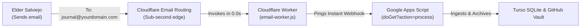

# Cloudflare Email Routing & Worker Trigger Guide
> **Philippines Dumaguete Mission • Elder Salviejo**

This directory contains the Cloudflare Worker that gives you **true 0.0-second instant execution** when an email arrives.

---

## How It Works



---

## 2 Ways to Use Cloudflare

### Method A: Cloudflare Email Routing (True 0-Second Instant Ingestion)
1. In the **Cloudflare Dashboard**, select your domain and click **Email Routing**.
2. Click **Add custom address**:
   - Custom address: `journal@yourdomain.com` (or `mission@yourdomain.com`)
   - Action: **Send to Worker**
   - Destination: Select `elder-salviejo-email-trigger`
3. Whenever an email arrives at `journal@yourdomain.com`, Cloudflare invokes the Worker in **0 milliseconds**, which immediately pings your Google Apps Script Web App URL!

---

### Method B: Cloudflare Scheduled Cron (Free 1-Minute Pinger)
If you do not have a custom domain on Cloudflare, you can use Cloudflare Workers as a free, 100% reliable cron trigger:
1. In `wrangler.toml`, uncomment:
   ```toml
   [triggers]
   crons = ["* * * * *"]
   ```
2. Deploy the worker. Cloudflare's edge network will ping your Apps Script Web App URL every 60 seconds automatically.

---

## How to Deploy to Cloudflare

1. Open your terminal in this repository:
   ```bash
   cd cloudflare
   ```

2. Log into Cloudflare with Wrangler:
   ```bash
   npx wrangler login
   ```

3. Set your private secrets securely:
   ```bash
   npx wrangler secret put APPS_SCRIPT_URL
   # (Enter your Google Apps Script Web App URL: https://script.google.com/macros/s/YOUR_ID/exec)

   npx wrangler secret put INGEST_SECRET
   # (Enter your private INGEST_SECRET)
   ```

4. Deploy:
   ```bash
   npx wrangler deploy
   ```

5. Once deployed, Wrangler will output your worker URL:
   `https://elder-salviejo-email-trigger.<your-subdomain>.workers.dev`
